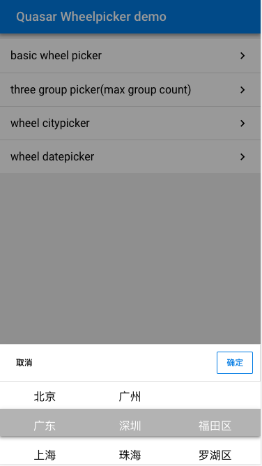
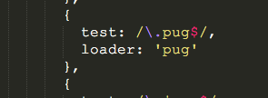

# Quasar Wheel Picker Plugin

> A Quasar framework plugin

## Wheel Picker Types & screenshots

* ####  Basic Picker

* #### Max Group Picker(less then 3 group count)

* #### City Picker(ZH)

* #### Date Picker

> ##### Basic Picker's screenshot


> ##### Max Group Picker's screenshot


> ##### City Picker's screenshot



> ##### Date Picker's screenshot


## Live Demo
[Experience](https://lenvonsam.github.io/Quasar-Wheel-Picker-Plugin/)


## How to Use
1. Install quasar-cli
``` bash
$ npm install -g quasar-cli
```
2. Install pug dependency
``` bash
$ npm install pug pug-loader pug-filters -D
```
after install pug,find build/webpack.base.conf.js, then add block code like this:



3. Copy src/components/picker fold to your project

4. Import picker plugin


5. Instance components


6. Using components


## Build Setup Demo project

``` bash
# install dependencies
$ npm install

# serve with hot reload at localhost:8080
$ quasar dev

# build for production with minification
$ quasar build

# lint code
$ quasar lint
```
